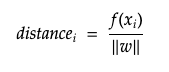

# Interpretable Wordembedding Classifiers

## Introduction
Wordembeddings can be increadibly useful as features in classification models. Word embeddings are dense low dimensional representations of words, and are created in such a way that words used in similar context receive a similar mathematical representation. Unlike bag-of-words approaches, wordembeddings can capture semantic relationships between words and are fairly light-weight compared to embeddings from more complex models like ELMO and BERT.

Despite their usefulness and high performance, wordembeddings can often be difficult to use in classification tasks where it is vital that researchers are able to explain the data generating process, not just provide an accurate prediction. The dimensions of the word embeddings are in and of themselves not interpretable, and therefore researchers often shy away from using them.

In this notebook I will present a simple framework to add interpretability to classifier models based on word embeddings, and a simple process for working our way back from predictions made by a classifier that takes wordembeddings as input to individual words or terms that the model seem to be using to discriminate your classes.

The approach can fairly simply be summarised as follows:

* Train a classifier that takes document level embeddings as input.
* Create a vocabulary matrix with ndividual word embeddings for all the words found in your corpus.
* Run the vocabulary matrix through the trained algorithm and pick out the individual words the algorithm feels the most certain belong to each class.

In the parts that follow I will demonstrate how this can be done by training a classifier to distinguish whether a newspaper headline came from a politics article or a sports article.


## Get News Headlines from The Guardian API

We firstly, need to get our data. The Guardian has a really good API for this purpose; so we can pull out all politics and sports articles from the Guardian between two arbitary points in time, say march and may 2018.


```python
from GuardianAPI import GuardianAPI
import pandas as pd
```


```python
gapi = GuardianAPI()
```

    api_key: ········


```python
sports_json = gapi.get_content({'section':'sport', 'from-date':'2018-03-1', 'to-date':'2018-05-30', 'code':'uk', 'page-size':50})
```


```python
politics_json = gapi.get_content({'section':'politics', 'from-date':'2018-03-1', 'to-date':'2018-05-30', 'code':'uk', 'page-size':50})
```


```python
df = pd.DataFrame(sports_json + politics_json)
df.sample(5)
```


<table border="1" class="dataframe">
  <thead>
    <tr style="text-align: right;">
      <th></th>
      <th>id</th>
      <th>type</th>
      <th>sectionId</th>
      <th>sectionName</th>
      <th>webPublicationDate</th>
      <th>webTitle</th>
      <th>webUrl</th>
      <th>apiUrl</th>
      <th>isHosted</th>
      <th>pillarId</th>
      <th>pillarName</th>
    </tr>
  </thead>
  <tbody>
    <tr>
      <th>401</th>
      <td>sport/2018/may/06/justify-kentucky-derby-mende...</td>
      <td>article</td>
      <td>sport</td>
      <td>Sport</td>
      <td>2018-05-06T00:08:06Z</td>
      <td>Justify reigns in the rain at Kentucky Derby a...</td>
      <td>https://www.theguardian.com/sport/2018/may/06/...</td>
      <td>https://content.guardianapis.com/sport/2018/ma...</td>
      <td>False</td>
      <td>pillar/sport</td>
      <td>Sport</td>
    </tr>
    <tr>
      <th>26</th>
      <td>sport/2018/may/28/marco-trungelliti-road-trip-...</td>
      <td>article</td>
      <td>sport</td>
      <td>Sport</td>
      <td>2018-05-28T21:13:10Z</td>
      <td>Marco Trungelliti makes 500-mile family road t...</td>
      <td>https://www.theguardian.com/sport/2018/may/28/...</td>
      <td>https://content.guardianapis.com/sport/2018/ma...</td>
      <td>False</td>
      <td>pillar/sport</td>
      <td>Sport</td>
    </tr>
    <tr>
      <th>2207</th>
      <td>politics/2018/mar/11/labour-mps-should-not-app...</td>
      <td>article</td>
      <td>politics</td>
      <td>Politics</td>
      <td>2018-03-11T11:15:13Z</td>
      <td>Labour MPs should not appear on Russia Today, ...</td>
      <td>https://www.theguardian.com/politics/2018/mar/...</td>
      <td>https://content.guardianapis.com/politics/2018...</td>
      <td>False</td>
      <td>pillar/news</td>
      <td>News</td>
    </tr>
    <tr>
      <th>2205</th>
      <td>politics/2018/mar/11/scottish-labour-conferenc...</td>
      <td>article</td>
      <td>politics</td>
      <td>Politics</td>
      <td>2018-03-11T15:43:53Z</td>
      <td>Scottish Labour conference backs Corbyn on Brexit</td>
      <td>https://www.theguardian.com/politics/2018/mar/...</td>
      <td>https://content.guardianapis.com/politics/2018...</td>
      <td>False</td>
      <td>pillar/news</td>
      <td>News</td>
    </tr>
    <tr>
      <th>316</th>
      <td>sport/2018/may/11/guildford-extend-record-run-...</td>
      <td>article</td>
      <td>sport</td>
      <td>Sport</td>
      <td>2018-05-11T18:28:33Z</td>
      <td>Chess: Guildford extend their record unbeaten ...</td>
      <td>https://www.theguardian.com/sport/2018/may/11/...</td>
      <td>https://content.guardianapis.com/sport/2018/ma...</td>
      <td>False</td>
      <td>pillar/sport</td>
      <td>Sport</td>
    </tr>
  </tbody>
</table>
</div>


## Pre-Trained Word Embeddings

We now need to get pre-trained word embeddings from gensims api and then create an embedding that represent each headline, by taking the average embedding of all the words used in each headline.


```python
# Call in depenencies
import gensim.downloader as api
import re
import numpy as np
from nltk.corpus import stopwords
```


```python
# Get glove embeddings
glove_vectors = api.load('glove-wiki-gigaword-300')
```


```python
# Get a set of stopwords
StopWords = set(stopwords.open('english'))
```


```python
def text_preprocess(text, word_vectors, StopWords):
    tmp_txt = text.lower() # lowercase all text
    tmp_txt = re.sub(r'\!', ' ! ', tmp_txt) # add a a space to each exclamation mark to ensure they get a token
    tmp_txt = re.sub(r'\?', ' ? ', tmp_txt) # add a a space to each question mark to ensure they get a token
    if stopwords:
        tokens = [w for w in tmp_txt.split() if w in word_vectors.vocab and w not in StopWords]
    else:
        tokens = [w for w in tmp_txt.split() if w in word_vectors.vocab]
    return tokens
```


```python
def doc_vector(tokens, word_vectors):
    doc_vec = np.mean(np.array([word_vectors[word]
                                 for word in tokens]), axis = 0)
    return doc_vec
```


```python
def concat_texts(corpus, word_vectors):
    out_matrix = np.empty((len(corpus), 300), float)
    for row,txt in enumerate(corpus):
        out_matrix[row] = doc_vector(txt, word_vectors)
    return out_matrix
```


```python
headlines_processed = [text_preprocess(x, glove_vectors, StopWords) for x in df.webTitle]
```


```python
headline_matrix = concat_texts(headlines_processed, glove_vectors)
headline_matrix.shape
```


    (2293, 300)


## Split data into Training and Test Set


```python
# Call dependency
from sklearn.model_selection import train_test_split
```


```python
# Split data into train and test
X_train, X_test, y_train, y_test = train_test_split(headline_matrix, 
                                                    df.sectionId, 
                                                    test_size=0.2, 
                                                    random_state=123)
```


```python
print('Training Examples: ', X_train.shape, "\n"
      'Test Examples: ', X_test.shape)
```

    Training Examples:  (1834, 300) 
    Test Examples:  (459, 300)


## Get Vocabulary Matrix

We then need to get a matrix of individual words used in the model, that we can use to work our way back from a model prediction to a set of terms that explain those predictions. We can do this by tokenising all the data in our corpus and put these tokens into a set.


```python
vocab = set()
for headline in df.webTitle:
    vocab.update([w.lower() for w in headline.split() if w.lower() in glove_vectors.vocab])
vocab = list(vocab)
```


```python
vocab_matrix = np.array([glove_vectors[w] for w in vocab])
```

## Train Models


```python
from sklearn.metrics import classification_report
import matplotlib.pyplot as plt
```

## Support Vector Machine

Support Vector Machines attempts to find a line or hyperplane that separates the datapoints from each class with the largest possible margin.

One way to understand what our model is picking up on is to calculate the distance of each of the words in our vocabulary to the decision plane. Words that are far from the decision plane are presumably more discriminative, and should therefore give us a clue as to what the model is picking up on. Similarly, words that are very close to the separating line should be words that are not discriminatory; meaning either general vocabulary or terms typically used in both domains.

We can get the distance of each word from the decision boundary by taking the decision function value we get from running the word through the trained algorithm divided by the l2 norm of the coefficient vector.



Below is a two-dimentional illustration of what we expect to see, but the intuition generalises to multiple dimensions


## Train and Fit Model


```python
from sklearn.svm import SVC
```


```python
svm = SVC(kernel = 'linear', C = 1, class_weight='balanced')
```


```python
svm.fit(X_train, y_train)
```


    SVC(C=1, break_ties=False, cache_size=200, class_weight='balanced', coef0=0.0,
        decision_function_shape='ovr', degree=3, gamma='scale', kernel='linear',
        max_iter=-1, probability=False, random_state=None, shrinking=True,
        tol=0.001, verbose=False)


## Predict on unseen data


```python
y_pred = svm.predict(X_test)
print(classification_report(y_test, y_pred))
```

                  precision    recall  f1-score   support
    
        politics       0.91      0.97      0.94       158
           sport       0.98      0.95      0.97       301
    
        accuracy                           0.96       459
       macro avg       0.95      0.96      0.95       459
    weighted avg       0.96      0.96      0.96       459
    


## Calculate distance from each word to the decision boundary


```python
dist = svm.decision_function(vocab_matrix) / np.linalg.norm(svm.coef_)
```


```python
distance_df = pd.DataFrame({'word':vocab, 'distance':dist})
```

## Sort Vocabulary Words by distance to the decision boundary


```python
distance_df.sort_values('distance', ascending = False).head(10)
```


<table border="1" class="dataframe">
  <thead>
    <tr style="text-align: right;">
      <th></th>
      <th>word</th>
      <th>distance</th>
    </tr>
  </thead>
  <tbody>
    <tr>
      <th>2582</th>
      <td>sevens</td>
      <td>2.561792</td>
    </tr>
    <tr>
      <th>82</th>
      <td>a-league</td>
      <td>2.385136</td>
    </tr>
    <tr>
      <th>2350</th>
      <td>rugby</td>
      <td>2.384202</td>
    </tr>
    <tr>
      <th>1203</th>
      <td>nrl</td>
      <td>2.268408</td>
    </tr>
    <tr>
      <th>1135</th>
      <td>paralympic</td>
      <td>2.252786</td>
    </tr>
    <tr>
      <th>213</th>
      <td>championship</td>
      <td>2.213799</td>
    </tr>
    <tr>
      <th>2177</th>
      <td>cycling</td>
      <td>2.199589</td>
    </tr>
    <tr>
      <th>4190</th>
      <td>tennis</td>
      <td>2.159167</td>
    </tr>
    <tr>
      <th>3435</th>
      <td>tournament</td>
      <td>2.144038</td>
    </tr>
    <tr>
      <th>755</th>
      <td>squad</td>
      <td>2.125921</td>
    </tr>
  </tbody>
</table>
</div>


We can clearly see that the words that are the furthest from the decision boundary on the positive side are all sports related words like rugby, paralympic and tournament. This suggest that these words and words similar to them are particlarly important for the model to recognise a headline as a sports headline.

When looking at the words that are the furthest away from the decision boundary on the negative side, these are, as suspected political terms like minister, labour and parliament. Again this tells us that our model are focusing on terms that are similar to these when deciding whether to classify a headline as a politics headline.


```python
distance_df.sort_values('distance', ascending = True).head(10)
```


<table border="1" class="dataframe">
  <thead>
    <tr style="text-align: right;">
      <th></th>
      <th>word</th>
      <th>distance</th>
    </tr>
  </thead>
  <tbody>
    <tr>
      <th>803</th>
      <td>minister</td>
      <td>-2.222333</td>
    </tr>
    <tr>
      <th>3697</th>
      <td>labour</td>
      <td>-2.092312</td>
    </tr>
    <tr>
      <th>1654</th>
      <td>parliament</td>
      <td>-2.006268</td>
    </tr>
    <tr>
      <th>2021</th>
      <td>liberal</td>
      <td>-1.884801</td>
    </tr>
    <tr>
      <th>4103</th>
      <td>tory</td>
      <td>-1.868131</td>
    </tr>
    <tr>
      <th>508</th>
      <td>party</td>
      <td>-1.847066</td>
    </tr>
    <tr>
      <th>2063</th>
      <td>conservatives</td>
      <td>-1.814579</td>
    </tr>
    <tr>
      <th>2584</th>
      <td>chancellor</td>
      <td>-1.798007</td>
    </tr>
    <tr>
      <th>5290</th>
      <td>tories</td>
      <td>-1.710996</td>
    </tr>
    <tr>
      <th>5216</th>
      <td>conservative</td>
      <td>-1.624608</td>
    </tr>
  </tbody>
</table>
</div>


We can look at words that are close to the decision boundary. Here we find as hypothesised a set of words that are either not associated with either politics or sports, like *credentials* or *barrles*, or associated with both, like *appeal* or *affected*.


```python
distance_df.loc[distance_df.distance.between(-0.01, 0.01)].head(10)
```


<table border="1" class="dataframe">
  <thead>
    <tr style="text-align: right;">
      <th></th>
      <th>word</th>
      <th>distance</th>
    </tr>
  </thead>
  <tbody>
    <tr>
      <th>18</th>
      <td>launch</td>
      <td>0.001324</td>
    </tr>
    <tr>
      <th>117</th>
      <td>appeal</td>
      <td>-0.008476</td>
    </tr>
    <tr>
      <th>145</th>
      <td>vital</td>
      <td>0.009059</td>
    </tr>
    <tr>
      <th>195</th>
      <td>bale</td>
      <td>-0.002664</td>
    </tr>
    <tr>
      <th>303</th>
      <td>affected</td>
      <td>-0.005008</td>
    </tr>
    <tr>
      <th>329</th>
      <td>mcnicholl</td>
      <td>-0.009333</td>
    </tr>
    <tr>
      <th>354</th>
      <td>credentials</td>
      <td>0.001708</td>
    </tr>
    <tr>
      <th>473</th>
      <td>barrel</td>
      <td>-0.005074</td>
    </tr>
    <tr>
      <th>518</th>
      <td>anything</td>
      <td>0.007034</td>
    </tr>
    <tr>
      <th>571</th>
      <td>aims</td>
      <td>0.007861</td>
    </tr>
  </tbody>
</table>
</div>


# Logistic Regression

We can make a similar form of analysis using a logistic regression. However, rather than calculating the distance of all our vocabulary words from the decision boundary, we predict the class probability of each word.


## Train Model


```python
# Dependency
from sklearn.linear_model import LogisticRegression
```


```python
lr = LogisticRegression()
```


```python
lr.fit(X_train, y_train)
```


    LogisticRegression(C=1.0, class_weight=None, dual=False, fit_intercept=True,
                       intercept_scaling=1, l1_ratio=None, max_iter=100,
                       multi_class='auto', n_jobs=None, penalty='l2',
                       random_state=None, solver='lbfgs', tol=0.0001, verbose=0,
                       warm_start=False)


```python
y_pred = svm.predict(X_test)
print(classification_report(y_test, y_pred))
```

                  precision    recall  f1-score   support
    
        politics       0.91      0.97      0.94       158
           sport       0.98      0.95      0.97       301
    
        accuracy                           0.96       459
       macro avg       0.95      0.96      0.95       459
    weighted avg       0.96      0.96      0.96       459
    


## Get probability score for each vocabulary word


```python
prob_df = pd.DataFrame({'word':vocab, 'probability':lr.predict_proba(vocab_matrix)[:,0]})
```


```python
prob_df.sort_values('probability', ascending = True).head(10)
```


<table border="1" class="dataframe">
  <thead>
    <tr style="text-align: right;">
      <th></th>
      <th>word</th>
      <th>probability</th>
    </tr>
  </thead>
  <tbody>
    <tr>
      <th>2582</th>
      <td>sevens</td>
      <td>0.000000e+00</td>
    </tr>
    <tr>
      <th>3435</th>
      <td>tournament</td>
      <td>2.220446e-16</td>
    </tr>
    <tr>
      <th>213</th>
      <td>championship</td>
      <td>2.220446e-16</td>
    </tr>
    <tr>
      <th>2350</th>
      <td>rugby</td>
      <td>8.881784e-16</td>
    </tr>
    <tr>
      <th>82</th>
      <td>a-league</td>
      <td>1.998401e-15</td>
    </tr>
    <tr>
      <th>4410</th>
      <td>finals</td>
      <td>1.998401e-15</td>
    </tr>
    <tr>
      <th>3602</th>
      <td>champions</td>
      <td>3.530509e-14</td>
    </tr>
    <tr>
      <th>1203</th>
      <td>nrl</td>
      <td>3.819167e-14</td>
    </tr>
    <tr>
      <th>4190</th>
      <td>tennis</td>
      <td>4.796163e-14</td>
    </tr>
    <tr>
      <th>755</th>
      <td>squad</td>
      <td>7.638334e-14</td>
    </tr>
  </tbody>
</table>
</div>


Again we are seeing near identical results to what we saw with the support vector machines. All terms with a low probability of being a politics headline are sports terms.

Of the words given a high probability for politics article, we see the same politics terms popping up as with the svm.


```python
prob_df.sort_values('probability', ascending = False).head(10)
```


<table border="1" class="dataframe">
  <thead>
    <tr style="text-align: right;">
      <th></th>
      <th>word</th>
      <th>probability</th>
    </tr>
  </thead>
  <tbody>
    <tr>
      <th>803</th>
      <td>minister</td>
      <td>1.0</td>
    </tr>
    <tr>
      <th>3697</th>
      <td>labour</td>
      <td>1.0</td>
    </tr>
    <tr>
      <th>1654</th>
      <td>parliament</td>
      <td>1.0</td>
    </tr>
    <tr>
      <th>2021</th>
      <td>liberal</td>
      <td>1.0</td>
    </tr>
    <tr>
      <th>508</th>
      <td>party</td>
      <td>1.0</td>
    </tr>
    <tr>
      <th>2063</th>
      <td>conservatives</td>
      <td>1.0</td>
    </tr>
    <tr>
      <th>4103</th>
      <td>tory</td>
      <td>1.0</td>
    </tr>
    <tr>
      <th>1034</th>
      <td>parliamentary</td>
      <td>1.0</td>
    </tr>
    <tr>
      <th>5290</th>
      <td>tories</td>
      <td>1.0</td>
    </tr>
    <tr>
      <th>435</th>
      <td>prime</td>
      <td>1.0</td>
    </tr>
  </tbody>
</table>
</div>


# Random Forests

As you may have realised by now, this approach should work for any classifier that can output a probability score, be that a simple decision tree, a naive bayes or a deep neural network.

As a final demonstration, I will run the task through a Random Forest Classifier. 


```python
from sklearn.ensemble import RandomForestClassifier
```


```python
rf = RandomForestClassifier(criterion = 'entropy', max_depth = 15)
```


```python
rf.fit(X_train, y_train)
```


    RandomForestClassifier(bootstrap=True, ccp_alpha=0.0, class_weight=None,
                           criterion='entropy', max_depth=15, max_features='auto',
                           max_leaf_nodes=None, max_samples=None,
                           min_impurity_decrease=0.0, min_impurity_split=None,
                           min_samples_leaf=1, min_samples_split=2,
                           min_weight_fraction_leaf=0.0, n_estimators=100,
                           n_jobs=None, oob_score=False, random_state=None,
                           verbose=0, warm_start=False)


```python
y_pred = rf.predict(X_test)
print(classification_report(y_test, y_pred))
```

                  precision    recall  f1-score   support
    
        politics       0.91      0.87      0.89       158
           sport       0.93      0.95      0.94       301
    
        accuracy                           0.92       459
       macro avg       0.92      0.91      0.91       459
    weighted avg       0.92      0.92      0.92       459
    


```python
tree_df = pd.DataFrame({'word':vocab ,'probability':rf.predict_proba(vocab_matrix)[:,0]})
```


```python
tree_df.sort_values('probability', ascending = False).head(10)
```


<table border="1" class="dataframe">
  <thead>
    <tr style="text-align: right;">
      <th></th>
      <th>word</th>
      <th>probability</th>
    </tr>
  </thead>
  <tbody>
    <tr>
      <th>3697</th>
      <td>labour</td>
      <td>0.93</td>
    </tr>
    <tr>
      <th>2892</th>
      <td>labor</td>
      <td>0.92</td>
    </tr>
    <tr>
      <th>1654</th>
      <td>parliament</td>
      <td>0.90</td>
    </tr>
    <tr>
      <th>106</th>
      <td>lawmakers</td>
      <td>0.90</td>
    </tr>
    <tr>
      <th>2028</th>
      <td>political</td>
      <td>0.90</td>
    </tr>
    <tr>
      <th>5216</th>
      <td>conservative</td>
      <td>0.88</td>
    </tr>
    <tr>
      <th>508</th>
      <td>party</td>
      <td>0.87</td>
    </tr>
    <tr>
      <th>2021</th>
      <td>liberal</td>
      <td>0.87</td>
    </tr>
    <tr>
      <th>2063</th>
      <td>conservatives</td>
      <td>0.86</td>
    </tr>
    <tr>
      <th>634</th>
      <td>reform</td>
      <td>0.86</td>
    </tr>
  </tbody>
</table>
</div>


```python
tree_df.sort_values('probability', ascending = True).head(10)
```

<table border="1" class="dataframe">
  <thead>
    <tr style="text-align: right;">
      <th></th>
      <th>word</th>
      <th>probability</th>
    </tr>
  </thead>
  <tbody>
    <tr>
      <th>213</th>
      <td>championship</td>
      <td>0.07</td>
    </tr>
    <tr>
      <th>2372</th>
      <td>games</td>
      <td>0.07</td>
    </tr>
    <tr>
      <th>4049</th>
      <td>matches</td>
      <td>0.07</td>
    </tr>
    <tr>
      <th>4410</th>
      <td>finals</td>
      <td>0.07</td>
    </tr>
    <tr>
      <th>2020</th>
      <td>scoring</td>
      <td>0.09</td>
    </tr>
    <tr>
      <th>3202</th>
      <td>beating</td>
      <td>0.09</td>
    </tr>
    <tr>
      <th>2485</th>
      <td>softball</td>
      <td>0.12</td>
    </tr>
    <tr>
      <th>2247</th>
      <td>beat</td>
      <td>0.12</td>
    </tr>
    <tr>
      <th>3764</th>
      <td>thrilling</td>
      <td>0.12</td>
    </tr>
    <tr>
      <th>3974</th>
      <td>prix</td>
      <td>0.13</td>
    </tr>
  </tbody>
</table>
</div>


## Conclusion

In this notebook I have proposed and demonstrated a simple approach to add interpretability to any classifier taking word embeddings as features. This simple approach allows you to sense check that what your classifier picks up is reasonable, and at least to some extent explain the data generating process.

All though this approach is not directly applicable to regression problems, you can do something fairly similar... but that is for another post.
